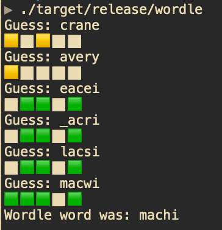

# Wordle

Just a simple [wordle](https://en.wikipedia.org/wiki/Wordle) clone I threw together in order to learn Rust a bit better.  I decided to include the word list in the binary, since it would keep everything nice and contained.

To build, run:
``` shell
cargo build --release
```


